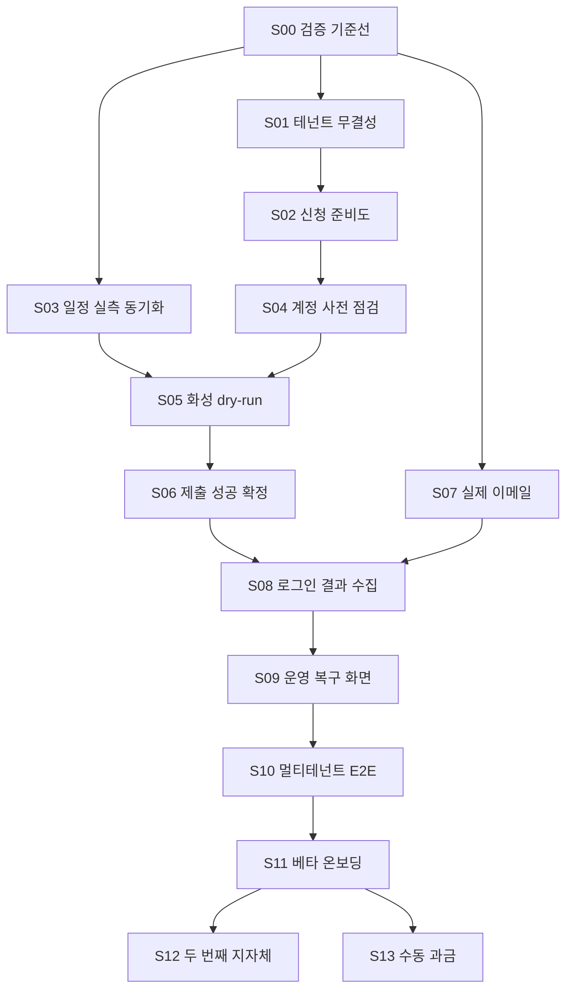

# 유니(youni) 세부 개발 계획서

> 문서 버전: v1.1 · 기준일: 2026-08-01 · 실행 단위: 1인 기준 0.5~2일의 검증 가능한 수직 슬라이스

## 1. 목적

이 문서는 기존 코드를 다시 설계하는 문서가 아니라, 현재 저장소를 **화성 실사용 → 전체 신청
사이클 → 제한 베타 → 유료화** 순서로 안전하게 완성하기 위한 실행 백로그다.

모든 슬라이스는 사용자 가치, 코드 변경, 데이터 변경, 테스트, 운영 확인을 함께 끝낸다.
화면만 만들거나 백엔드만 만든 상태를 완료로 처리하지 않는다.

## 2. 현재 구현 상태

코드와 문서를 대조한 결과다.

| 영역 | 상태 | 현재 근거 | 출시 전 남은 일 |
|---|---|---|---|
| 인증 | 구현 | Supabase 매직링크, 콜백, 보호 미들웨어 | 오류 추적, 세션 E2E |
| 테넌시 | 부분 구현 | 테넌트/멤버십 RLS, 생성 RPC, S01 복합 FK·트리거·worker 방어 | S01 SQL 실DB 검증, 테넌트 선택 정책 |
| 사업자/계정 | 부분 구현 | 프로필 CRUD 일부, 비밀번호 AES-256-GCM 저장, S04 D-1 로그인 사전 점검 코드 | 수정/삭제, 실계정 로그인 검증(실사이트) |
| 시안 | 부분 구현 | Storage 업로드, 이미지 크기, AI 규격 검증, S02 최신 검증 제출 게이트 | MIME/확장자 강화, 비용 제어 |
| 자동 신청 | 코드 완료 | S01 관계 무결성, S02 준비도 체크리스트·DB 게이트·1회 신청 만료 | SQL 실DB 회귀 테스트, 상태 변경 UX |
| 창구/스케줄러 | 코드 완료 | S02 실행 직전 준비도, S03 규칙·실측 일정 우선순위·diff·일일 crawl 큐잉, S04 D-1 계정 사전 점검·제출 상태 가드 | SQL 실DB 회귀, 실사이트 관측·실계정 로그인, 운영자 검토 UI |
| 화성 어댑터 | 부분 구현 | 게시대/일정 파서, 로그인, dry-run/제출 흐름 | 실계정 리허설, 최종 성공 신호 검증 |
| 감사 증적 | 부분 구현 | 단계별 스크린샷 Storage 업로드 | HTML 스냅샷, 사용자/운영자 조회, 보존 정책 |
| 재시도 | 부분 구현 | 오류 코드별 지연 재큐잉 | 상태 머신 강제, 원자성/경쟁 조건 테스트 |
| 캡차 릴레이 | 구현 골격 | Storage → DB → 웹 답변 → worker 폴링 | 실제 캡차 사이트 검증, 알림 없이는 사용 불가 |
| 알림 | 미구현 | DB 큐는 있으나 로그 후 `sent` 처리하는 stub | 실제 이메일 발송, 실패/재시도/공급자 ID |
| 결과 수집 | 미구현에 가까움 | 공개 컨텍스트 파서 골격 | uriad 계정 로그인 후 마이페이지 수집 |
| 관리자 운영 | 미구현 | DB에는 attempts/crawl_runs/results 존재 | 운영 화면, 재시도, 결과 수동 매칭 |
| 자동 테스트 | 부분 구현 | core 141개, adapters 17개 통과 | worker/web/DB 통합·E2E, RLS 테스트 |
| 배포 | 문서/설정 존재 | Vercel/Fly/Supabase 가이드, CI | 실제 환경 검증, 모니터링, 복구 연습 |

### 2.1 2026-08-01 검증 결과

- `corepack pnpm verify`: build → typecheck → lint → test 전체 통과
- 자동 테스트 158개 통과
  - `@youni/core`: 141개(무결성 14개, readiness 29개, schedule 24개, query fail-closed 5개,
    S04 precheck 59개 포함)
  - `@youni/adapters`: 17개(화성 schedule 파서 실패 분류 3개, S04 증적 캡처 금지 3개 포함)
- 패키지를 의존성 순서로 빌드한 후 워크스페이스 전체 TypeScript 검사 통과
- 루트 ESLint가 `apps`와 `packages`의 TypeScript 파일을 실제 검사
- 실제 Supabase·Redis·Playwright 실사이트 통합 테스트는 환경 자격정보가 없어 미실행
- `supabase/tests/*.sql`(0002~0005) 회귀 테스트는 이 환경에 Docker/psql이 없어 **미실행**

### 2.2 Orca 오케스트레이션 진행 상태

| 슬라이스 | 상태 | 검증/남은 게이트 |
|---|---|---|
| S00 검증 기준선 | 완료 | `corepack pnpm verify` 통과 |
| S01 참조 무결성 | 코드·리뷰 완료 | TS 14개 회귀 테스트 통과, SQL 회귀 테스트는 Docker/Postgres 환경에서 실행 대기 |
| S02 신청 준비도 | 코드·리뷰 완료 | UI·DB·scheduler 게이트와 S02R fail-closed 보완 완료, SQL 회귀 테스트는 Docker/Postgres 환경에서 실행 대기 |
| S03 일정 동기화 | 코드·리뷰 완료 | 대상 게시기간 단일 창구, `manual > crawled > rule`, 위험 변경 수동 검토·CAS 보완 완료; SQL 회귀·실사이트 crawl 대기 |
| S04 계정 사전 점검 | 코드·테스트 완료 | 가짜 어댑터 기반 자동 테스트 59개 통과(로그인 성공/실패, 계정 공유 1회 로그인, 실패 격리, 회수 소진 fail-closed, 알림 멱등, 제출 상태 가드). 0005 SQL 회귀 테스트와 **실계정·실사이트 로그인 검증은 대기** |

## 3. 상용화 차단 항목

다음 항목은 기능 추가보다 먼저 해결해야 한다.

### B1. 테넌트 간 참조 무결성

`application_requests`의 `tenant_id`는 RLS로 제한되지만 `profile_id`, `credential_id`, `design_id`가
같은 테넌트인지 DB 제약으로 보장하지 않는다. worker는 service role로 이 참조를 읽으므로,
추측한 UUID가 들어가면 다른 테넌트 데이터를 조합할 위험이 있다.

### B2. 알림이 실제로 발송되지 않음

`apps/worker/src/processors/notify.ts`는 pending 알림을 로그만 남기고 `sent`로 바꾼다.
캡차, 사전 점검 실패, 제출 실패를 사용자가 알 수 없으므로 무인 운영이 불가능하다.

### B3. 결과 수집이 인증 없이 실행됨

uriad 결과는 사용자 마이페이지에 있지만 현재 결과 잡은 로그인하지 않은 `CrawlContext`로
`fetchResults`를 호출한다. 정상 사이트에서도 0건이 반환되어 전체 사이클을 닫을 수 없다.

### B4. 제출 성공을 확정하지 않음

화성 어댑터는 최종 버튼 클릭 후 접수번호가 없어도 `submitted`를 반환한다. 오류 페이지나
유효성 경고도 성공으로 오인할 수 있다.

### B5. 상태 머신이 저장 경로에서 사용되지 않음

`packages/core/src/stateMachine.ts`는 테스트되지만 worker의 DB update가 이를 호출하지 않는다.
중복 worker나 늦은 재시도로 상태가 역행할 수 있다.

## 4. 개발 운영 규칙

### 4.1 슬라이스 규칙

- 한 슬라이스는 사용자 또는 운영자가 확인할 수 있는 하나의 결과로 끝낸다.
- 예상 2일을 넘으면 데이터, 백엔드, UI로 나누지 말고 더 작은 사용자 시나리오로 나눈다.
- DB 변경은 새 migration 파일로 추가하고 기존 `0001_init.sql`을 운영 중에 수정하지 않는다.
- 외부 사이트 조작은 기본 `dry_run=true`와 기능 플래그 뒤에서 개발한다.
- 실제 제출을 포함한 테스트는 테스트 계정·대상·창구·승인자를 명시한다.
- 모든 장애 경로에는 사용자 메시지와 운영자 진단 정보가 있어야 한다.

### 4.2 Definition of Ready

슬라이스 시작 전에 다음이 정해져야 한다.

- 사용자 시나리오 한 문장
- 변경할 데이터와 외부 시스템
- 성공/실패 판정 신호
- 실제 제출·결제·메시지 발송 여부
- 기능 플래그와 되돌리기 방법

### 4.3 Definition of Done

- 수용 기준을 자동 테스트 또는 재현 가능한 수동 절차로 확인
- 타입검사와 관련 테스트 통과
- 신규 실패 경로에 로그·상태·사용자 안내 존재
- migration, 환경변수, 운영 절차 문서 반영
- dry-run 또는 제한 계정에서 운영 확인
- 다음 슬라이스가 현재 구현의 내부 사정을 몰라도 시작 가능

## 5. 슬라이스 의존성



동시에 진행할 작업은 최대 하나다. 외부 승인 대기 중일 때만 문서·테스트 슬라이스를 병행한다.

## 6. 실행 슬라이스

### S00. 재현 가능한 검증 기준선 — 완료

- 예상: 0.5~1일
- 사용자 가치: 변경으로 핵심 흐름이 깨졌는지 매 PR에서 알 수 있다.
- 변경 후보:
  - 각 패키지 `package.json`에 실제 `lint` 스크립트 추가
  - 루트 검증 스크립트를 Corepack에서도 재현 가능하게 정리
  - CI에 테스트 개수와 빌드 산출물 확인 추가
  - worker 순수 로직을 DB/브라우저에서 분리할 테스트 seam 정의
- 수용 기준:
  - 깨끗한 체크아웃에서 한 명령으로 install → build → typecheck → lint → test가 성공한다.
  - lint가 0개 task로 성공하지 않는다.
  - 실패한 단계가 CI 로그에 분명히 표시된다.
- 검증:
  - `corepack pnpm install --frozen-lockfile`
  - `corepack pnpm build`
  - `corepack pnpm typecheck`
  - `corepack pnpm lint`
  - `corepack pnpm test`
- 롤백: CI 스크립트만 되돌릴 수 있으며 제품 동작에는 영향 없음

### S01. 테넌트·지자체 참조 무결성 강제 — 코드·리뷰 완료

- 예상: 1.5~2일
- 사용자 가치: 다른 고객 데이터가 신청에 섞이지 않는다.
- 변경 후보:
  - `supabase/migrations/0002_tenant_reference_integrity.sql`
  - `application_requests` 생성 보안 RPC 또는 복합 FK/검증 trigger
  - `design_validations`의 design/tenant 일치 검증
  - worker `loadJobContext` 방어 검증
  - `apps/web/app/(dashboard)/requests/actions.ts`
- 수용 기준:
  - 프로필·계정·시안은 모두 요청과 같은 tenant여야 한다.
  - 계정·게시대는 요청과 같은 municipality여야 한다.
  - 위조 UUID를 넣은 직접 API 요청이 DB에서 거부된다.
  - worker가 기존 불일치 데이터를 만나면 외부 사이트에 접속하지 않고 `needs_manual` 처리한다.
- 자동 테스트:
  - 사용자 A가 사용자 B의 profile/design UUID로 요청 생성 시 실패
  - 다른 지자체 credential/board 결합 시 실패
  - 정상 조합은 성공
- 롤백: 제약 추가 전 불일치 레코드 조회·격리 SQL을 함께 준비
- 선행: S00

### S02. 신청 준비도(readiness)와 등록 게이트

- 예상: 1.5일
- 사용자 가치: 실행되지 않을 자동 신청을 등록하기 전에 문제를 해결할 수 있다.
- 실행 분할:
  - **S02A 등록 게이트**: 공통 readiness 판정, DB 권위 검증, server action, 해결 링크가 있는 UI 체크리스트
  - **S02B scheduler 게이트**: worker 재검증, 비활성 지자체 차단, `once` 요청의 첫 잡 생성 후 만료
- 변경 후보:
  - `packages/core`에 readiness 타입과 판정 함수
  - 신청 등록 server action 검증
  - 자동 신청 화면 체크리스트
  - scheduler의 municipality status/capability 필터
- 판정 항목:
  - 지자체 `active` 및 `autoSubmit=true`
  - credential 존재·지자체 일치·`invalid/locked` 아님
  - profile 필수값 존재
  - design validation 최신 버전 존재, `fail` 아님
  - 활성 게시대 한 개 이상
- 수용 기준:
  - P0 조건 누락 시 자동 신청을 만들지 않고 해결 링크를 보여준다.
  - `beta/broken/disabled`는 assisted manual만 선택할 수 있다.
  - `once` 신청은 첫 잡 생성 후 `expired`로 전이된다.
- 테스트:
  - readiness 항목별 단위 테스트
  - server action 우회 요청 통합 테스트
  - scheduler가 비활성 지자체 잡을 만들지 않는 테스트
- 선행: S01

### S03. 규칙 일정과 실측 일정 동기화

- 예상: 1~1.5일
- 사용자 가치: 잘못된 정적 일정 때문에 신청 시점을 놓치지 않는다.
- 현재 문제:
  - crawl payload는 `schedule/spec`을 허용하지만 processor는 `boards/health`만 처리한다.
  - 스케줄러는 DB 정적 `window_rule`만으로 창구를 만든다.
- 변경 후보:
  - `apps/worker/src/processors/crawl.ts`
  - `application_windows`의 crawled upsert 및 출처 우선순위
  - schedule crawl 주기와 diff 기록
- 규칙:
  - 실측 `source=crawled`가 같은 대상 기간의 rule 값보다 우선한다.
  - 오픈 24시간 이내 일정 변경은 운영자 알림과 수동 확인을 요구한다.
  - 파싱 0건은 “일정 없음”과 “파서 실패”를 구분한다.
- 수용 기준:
  - 화성 fixture에서 일정 crawl → window upsert가 재현된다.
  - 동일 일정 재수집은 중복 행을 만들지 않는다.
  - 날짜 변경은 `crawl_runs.diff_summary`에 이전/신규 값을 남긴다.
- 선행: S00

### S04. D-1 계정 로그인 사전 점검 — 코드·테스트 완료

- 예상: 1.5~2일
- 사용자 가치: 창구가 열린 뒤 비밀번호 오류를 발견하는 일을 막는다.
- 이전 문제: precheck는 사이트 selector만 확인하고 각 credential로 로그인하지 않았다.
- 구현 결과:
  - `packages/core/src/precheck.ts` — 순수 판정(로그인 실패 분류, 계정 그룹핑·참조 검증,
    클레임/재시도 계획, 비밀 마스킹)과 포트 주입 오케스트레이션 `runWindowPrecheck`
  - `apps/worker/src/processors/precheck.ts` — Supabase/Playwright/어댑터 배선.
    계정마다 새 BrowserContext, 복호화는 `adapter.login` 직전 1회, 증적은 단계 이름만
  - `packages/adapters/src/common/audit.ts` — `stepNameOnlyAuditTrail`(스크린샷/HTML 미캡처)
  - `supabase/migrations/0005_credential_precheck.sql` — `credential_prechecks`
    unique(window_id, credential_id) + RLS(사용자 read-only)
  - `apps/worker/src/processors/submit.ts` — 저장 상태가 `pending/queued`가 아니면 no-op
- 수용 기준 대비 상태:
  - 창구의 고유 credential마다 한 번만 로그인한다 — 자동 테스트로 확인
  - 성공 시 `ok`, 실패 시 `invalid`/`locked`를 구분한다(근거 없으면 `invalid`) — 확인
  - 비밀번호·세션 쿠키가 로그·스크린샷·DB에 남지 않는다 — 고정 문구 저장 + 캡처 금지 테스트
  - 점검 실패 잡은 자동 제출되지 않는다 — `canStartSubmission` 가드로 확인
- 설계 선택:
  - 사이트 healthCheck 실패는 fail-closed — 지자체 `broken` + 그 창구의 pending/queued 잡
    전부 `needs_manual` + 잡별 멱등 `precheck_failed` 알림
  - `ok`가 아닌 모든 점검 결과는 그 계정의 pending/queued 잡만 `needs_manual`로 격리한다.
    다만 `site_credentials.status`는 계정 결함(`invalid`/`locked`)일 때만 바꾼다 —
    네트워크/셀렉터/캡차/복호화 오류(`error`)로 사용자 계정을 탓하지 않는다.
  - 잡 격리는 "알림 먼저, 잡 전환 나중" 순서다. 잡을 먼저 `needs_manual`로 바꾸면 그 잡은
    다음 실행의 후보에서 빠져, 중간에 실패했을 때 알림을 영영 받지 못한다.
  - `credential_prechecks`가 (창구 × 계정) 로그인 1회를 durable하게 보장한다.
    확정된 결과(`ok`/`invalid`/`locked`/`error`) 이후에는 재시도 잡이 와도 재로그인하지 않고
    결과만 재적용한다(계정 상태 복구 포함). 스케줄러 jobId의 1시간 버킷은 D-1 이후 새로
    생긴 잡까지 덮되, 재로그인은 이 terminal 레코드가 막는다.
  - 죽은 `running` 레코드의 회수 시도를 소진하면(`skip_exhausted`) 그 계정은 이 창구에서
    더 이상 로그인하지 않는다. 이때도 fail-closed다 — 계정 상태는 그대로 두고(계정 잘못이
    아니다) 그 계정의 pending/queued 잡만 `error` 문구로 `needs_manual` + 멱등 알림.
    매시간 다시 도는 잡이 늦게 생긴 잡에도 로그인 0회로 같은 격리를 적용한다.
- 테스트(모두 가짜 어댑터/가짜 포트 — 실제 지자체 사이트 접속 없음):
  - adapter login 성공/실패 fake, invalid/locked 구분
  - 동일 credential을 공유하는 여러 요청에서 로그인 1회
  - 한 계정 실패가 다른 계정 점검을 막지 않음(실패 격리)
  - 실패 알림 멱등성(재실행·신규 잡 포함)
  - 알림 생성과 잡 전환 사이에서 실패해도 재시도하면 잡 격리 1회 + 알림 1건
  - 결과 기록 CAS(클레임을 뺏기면 낡은 결과를 덮어쓰지 않고 실패)
  - 재적용이 저장된 `checked_at`으로 계정 상태를 복구(`last_login_ok_at` 시각 정확)
  - 회수 시도 소진 시 로그인 0회로 잡 격리 + 계정 상태 불변, 늦게 생긴 잡도 동일 차단
  - 제출 상태 가드(`needs_manual` 자동 제출 금지)
- 남은 게이트:
  - `supabase/tests/0005_credential_precheck_test.sql` 실DB 실행(Docker/psql 필요) — 미실행
  - 실제 지자체 계정으로 로그인 성공/실패를 확인하는 실사이트 리허설(M1, S05와 함께)
- 선행: S02

### S05. 화성 실계정 dry-run 리허설

- 예상: 코드 1일 + 실제 창구 1회
- 사용자 가치: 실제 제출 전에 자동화가 현재 사이트에서 동작함을 증명한다.
- 변경 후보:
  - 실제 HTML fixture 갱신
  - selector와 경로 보정
  - dry-run 전용 실행 명령 또는 운영자 액션
  - 증적 체크리스트
- dry-run 종료점:
  - 로그인 성공
  - 규약 동의
  - 희망 게시대 한 곳 선택
  - 시안 파일 첨부
  - 최종 제출 버튼 클릭 전 중단
- 수용 기준:
  - 외부 제출 요청이 발생하지 않는다.
  - 위 다섯 단계 스크린샷과 URL/시각이 저장된다.
  - 잡은 `submitted`가 아니라 명시적 `dry_run_completed` 의미로 표시된다.
    현재 스키마를 유지한다면 `needs_manual + dry-run 완료 코드`를 일관되게 사용한다.
  - fixture 회귀 테스트가 selector 변경을 감지한다.
- 수동 확인:
  - 실제 사이트 마이페이지에 신청이 생기지 않았는지 확인
  - audit Storage 경로와 화면 조회 확인
- 선행: S03, S04

### S06. 실제 제출 성공 확정과 멱등성

- 예상: 1.5~2일 + 승인된 실제 제출 1건
- 사용자 가치: “제출 완료”가 실제 접수 사실을 의미한다.
- 변경 후보:
  - uriad 성공/오류 페이지 fixture
  - `submitApplication` 성공 판정
  - worker 상태 전이 CAS(compare-and-set)
  - `selected_board_site_id`, 접수번호, 응답 스냅샷 저장
- 성공 확정 신호:
  1. 성공 문구 + 접수번호, 또는
  2. 제출 직후 마이페이지 신청 내역과 대상 기간/게시대 일치
- 수용 기준:
  - 성공 신호가 없으면 `submitted`로 전이하지 않는다.
  - `already_submitted`는 기존 마이페이지 기록과 일치할 때만 성공으로 복구한다.
  - 동일 잡을 두 worker가 실행해도 외부 제출은 최대 한 번이다.
  - 상태 변경마다 허용된 상태 머신 전이를 검증한다.
  - 실제 제출 1건의 접수번호와 증적을 운영자가 확인한다.
- 테스트:
  - 성공/경고/오류/타임아웃 HTML fixture
  - 중복 worker 경쟁 조건
  - 늦게 도착한 retry가 `submitted`를 덮지 못함
- 롤백: 지자체 `autoSubmit=false`, 환경 `SUBMIT_DRY_RUN_DEFAULT=true`
- 선행: S05

### S07. 실제 이메일 알림

- 예상: 1~1.5일
- 사용자 가치: 사용자가 창구·오류·캡차·결과를 제때 알 수 있다.
- 변경 후보:
  - Resend 등 이메일 공급자 adapter
  - 환경변수, 발신 도메인, 템플릿
  - `notifications`에 provider ID/attempt/error 컬럼 migration
  - failed → backoff retry → dead-letter 운영 흐름
- 수용 기준:
  - 테스트 수신함에서 모든 P0 이벤트를 실제 수신한다.
  - 공급자 성공 응답 뒤에만 `sent`로 표시한다.
  - 실패는 이유와 시도 횟수를 저장하고 재시도한다.
  - 캡차 메일은 만료 시각과 웹 딥링크를 포함한다.
  - 로그에 이메일 본문·민감 정보가 불필요하게 남지 않는다.
- 테스트:
  - 공급자 fake로 성공/429/5xx/영구 실패
  - 이벤트별 제목/필수 링크 snapshot
  - 동일 ref의 중복 발송 방지
- 선행: S00

### S08. 로그인 기반 결과 수집

- 예상: 2일 + 실제 결과 발표 1회
- 사용자 가치: 제출 후 마이페이지를 다시 방문하지 않아도 결과를 받는다.
- 변경 후보:
  - 결과 잡을 submitted job/credential 단위로 실행
  - credential 복호화와 adapter login
  - 마이페이지 결과 fixture 및 parser 강화
  - 결과 멱등키 migration
  - exact/fuzzy/manual 매칭 분리
- 수용 기준:
  - 각 사용자 세션에서 해당 창구 결과만 수집한다.
  - 접수번호 정확 일치는 자동 확정한다.
  - 이름/게시대 매칭은 사용자에게 알리기 전 운영자 확인을 거친다.
  - 빈 결과는 로그인 실패, 발표 전, selector 변경으로 분류한다.
  - 모든 대상 잡이 확정되거나 운영자가 종료한 뒤에만 `results_out`이 된다.
  - 같은 결과를 반복 수집해도 중복 행/알림이 생기지 않는다.
- 테스트:
  - 로그인 전 0건, 로그인 후 결과 fixture
  - 다른 기간 결과 제외
  - exact/fuzzy/unknown 매칭
  - 반복 실행 멱등성
- 선행: S06, S07

### S09. 운영자 복구 최소 화면

- 예상: 1.5~2일
- 사용자 가치: 장애가 생겨도 운영자가 빠르게 수동 신청을 안내하거나 안전하게 재처리한다.
- 화면 범위:
  - 오늘/다가오는 창구와 상태별 잡 수
  - 잡 상세: attempts, 마지막 단계, 오류, 감사 스크린샷
  - 허용된 상태에서만 재시도/취소
  - broken 어댑터와 최근 healthCheck
  - 미매칭 결과 수동 연결
- 수용 기준:
  - 관리자 권한 없는 사용자는 접근할 수 없다.
  - 재시도는 새 외부 제출 위험을 경고하고 멱등성 확인 뒤 실행된다.
  - 모든 운영자 액션에 actor, 시각, 이전/신규 상태가 남는다.
  - `needs_manual` 건에서 사용자에게 보낼 수동 신청 링크와 사유를 확인할 수 있다.
- 테스트:
  - 권한 테스트
  - terminal 상태 재시도 차단
  - 감사 로그 생성
- 선행: S06, S08

### S10. 멀티테넌트·핵심 사이클 E2E

- 예상: 1.5~2일
- 사용자 가치: 베타 고객을 추가해도 데이터 노출과 회귀 위험이 낮다.
- 범위:
  - 로컬 Supabase 또는 임시 프로젝트에서 사용자 A/B 생성
  - 가입 → 테넌트 → 프로필 → 계정 → 시안 → 요청
  - fake adapter/queue로 D-3 → precheck → submit → result 시뮬레이션
- 수용 기준:
  - A와 B는 서로의 모든 테넌트 행과 Storage 객체를 읽거나 참조할 수 없다.
  - 하나의 happy path가 DB 상태와 알림까지 완주한다.
  - 외부 사이트 없이 CI에서 결정적으로 실행된다.
  - 실제 사이트 smoke는 별도 수동 job으로 분리한다.
- 선행: S09

### S11. 베타 온보딩 체크리스트

- 예상: 1.5일
- 사용자 가치: 운영자 설명 없이 신청 준비 상태까지 도달한다.
- 범위:
  - 워크스페이스 → 프로필 → 계정 검증 → 시안 검증 → 자동 신청 단계 표시
  - 빈 상태, 오류 메시지, 다음 행동 링크
  - 약관/계정 위임/당첨 비보장 동의 기록
- 수용 기준:
  - 신규 사용자가 15분 안에 준비 가능한 신청을 만든다.
  - 준비 불가능한 beta 지자체는 기대치를 명확히 안내한다.
  - 계정 비밀번호를 다시 화면에 노출하지 않는다.
  - 3명의 관찰 테스트에서 치명적 막힘 0건
- 선행: S10

### S12. 두 번째 지자체 활성화

- 예상: 조사 포함 3~5일, 구현 슬라이스는 각 1~2일로 분할
- 권장 대상: 기존 공통 팩토리를 검증할 수 있는 오산 또는 시흥
- 하위 슬라이스:
  1. 경로·운영기관·규격·일정 실측 및 문서화
  2. boards/schedule/results fixture와 파서 테스트
  3. 실계정 로그인 + dry-run
  4. 실제 1건 제출 + 결과 사이클
- 수용 기준:
  - 어댑터 계약 테스트 통과
  - 실제 dry-run과 실제 제출 성공
  - healthCheck와 수동 폴백 동작
  - 위 조건 전에는 `autoSubmit=false`, status `beta` 유지
- 선행: S11

### S13. 첫 유료 고객용 수동 과금

- 예상: 1일
- 사용자 가치: 결제 모듈 없이도 가격과 지불 의사를 검증한다.
- 범위:
  - 플랜/월 청구액/청구 상태를 기록하는 최소 테이블 또는 운영 문서
  - 계좌이체 청구서, 입금 확인, 환불/해지 절차
  - 제품 사용 제한은 수동 운영
- 수용 기준:
  - 한 고객의 청구 → 입금 → 영수 처리 이력이 남는다.
  - 미납이 자동 신청을 갑자기 중단하지 않으며 운영자 확인 절차를 거친다.
  - 개인정보와 세무 자료 보관 위치가 정해진다.
- 선행: S11

### S14. 관측성·백업·창구 운영 런북

- 예상: 1~1.5일
- 사용자 가치: 장애를 고객보다 먼저 발견하고 복구할 수 있다.
- 범위:
  - Sentry 또는 동등한 오류 수집
  - worker heartbeat, queue 지연, 실패 잡, broken adapter 알림
  - Supabase 백업과 복구 연습
  - 월초 D-7~D+결과일 체크리스트
- 수용 기준:
  - 의도적으로 발생시킨 worker 예외를 5분 안에 운영자가 인지한다.
  - worker 중단 후 자동 재시작과 queued job 보존을 확인한다.
  - 테스트 데이터로 복구 절차를 1회 실행하고 소요 시간을 기록한다.
- 선행: S07, S09

### S15. 상품화 슬라이스

S00~S14와 유료 결제 1건 이후에만 시작한다.

| ID | 슬라이스 | 예상 | 완료 신호 |
|---|---|---:|---|
| S15-1 | 요금제 제한·사용량 집계 | 2일 | 플랜별 지자체/신청 한도 강제 |
| S15-2 | 정기결제 | 3~5일 | 결제·실패·해지·환불 sandbox E2E |
| S15-3 | 알림톡 | 2~3일+승인 | 템플릿 승인 및 실패 폴백 |
| S15-4 | 관리자 지자체 설정 | 2일 | 규격/일정 버전 검수·배포 |
| S15-5 | 지자체 안내/SEO | 페이지당 0.5일 | 출처·갱신일 있는 공개 정보 |
| S15-6 | 신뢰성 이중화 | 2일 | worker 장애 주입 시 잡 유실 0 |

## 7. 첫 10개 작업일 권장 순서

실사이트 창구 일정에 따라 S05만 창구에 맞춰 이동할 수 있다.

| 작업일 | 주 작업 | 당일 완료물 |
|---:|---|---|
| 1 | S00 | 로컬/CI 검증 한 명령, 실제 lint |
| 2~3 | S01 | migration, 보안 RPC/제약, 격리 테스트 |
| 4 | S02 | readiness 도메인 규칙과 등록 차단 |
| 5 | S02 | 체크리스트 UI와 scheduler 게이트 |
| 6 | S03 | schedule crawl/upsert/diff |
| 7~8 | S04 — 코드·테스트 완료 | credential 로그인 precheck와 실패 격리·알림 레코드(실계정 검증은 M1) |
| 9 | S07 | 실제 이메일 공급자 연동 |
| 10 | S05 준비 | 화성 fixture·dry-run 실행 도구·증적 체크 |

이후 실제 창구에서 S05를 통과하고 S06 → S08 → S09 순서로 한 사이클을 닫는다.

## 8. 테스트 전략

### 8.1 테스트 피라미드

| 계층 | 대상 | 실행 시점 |
|---|---|---|
| 순수 단위 | 창구 계산, readiness, 상태 전이, 매칭 | 모든 PR |
| fixture 계약 | 지자체 HTML 파서, 성공/오류 신호 | 모든 PR |
| DB 통합 | migration, RLS, RPC, 멱등성 | 모든 PR 또는 merge 전 |
| worker 통합 | fake adapter + fake notification provider + Redis | merge 전 |
| 웹 E2E | 온보딩과 신청 생성 | merge 전 |
| 실사이트 smoke | healthCheck, 로그인, dry-run | D-7, D-1, 승인된 수동 실행 |
| 실제 제출 | 제한 계정 1건 | 창구별 승인 후 |

### 8.2 외부 부작용 안전장치

- CI와 일반 개발 환경에서는 실제 제출 adapter를 호출하지 않는다.
- `SUBMIT_DRY_RUN_DEFAULT=true`를 기본값으로 유지한다.
- 실제 제출은 지자체, 계정, 게시대, target period를 화면에 재확인한 뒤 승인한다.
- 테스트 이메일은 별도 수신 도메인/태그를 사용한다.
- 운영 DB migration은 백업 확인 후 forward-only로 적용한다.

## 9. 데이터 migration 계획

권장 migration 순서다. 실제 구현 시 하나의 거대 migration 대신 슬라이스별로 추가한다.

| migration | 목적 |
|---|---|
| `0002_tenant_reference_integrity.sql` | 동일 tenant/municipality 참조 강제 (적용) |
| `0003_request_readiness.sql` | 자동 신청 준비도 게이트 트리거/RPC (적용) |
| `0004_window_schedule_identity.sql` | 창구 논리 키 unique(muni, target_period_start) (적용) |
| `0005_credential_precheck.sql` | D-1 계정 사전 점검 기록 unique(window, credential) (적용) |
| `0006_notification_delivery.sql` | provider ID, attempts, last_error, next_retry_at (예정) |
| `0007_result_idempotency.sql` | 결과 source key/잡/기간 중복 방지 (예정) |
| `0008_operator_audit.sql` | 운영자 액션 기록과 권한 (예정) |
| `0009_billing_manual.sql` | 첫 유료 고객 수동 청구(필요 시) |

migration마다 up 검증 SQL, 기존 데이터 사전 점검 SQL, 애플리케이션 호환 순서를 기록한다.

## 10. 리스크 기반 우선순위

| 위험 | 가능성 | 영향 | 우선 대응 |
|---|---:|---:|---|
| 교차 테넌트 데이터 결합 | 중 | 매우 큼 | S01 |
| 제출 실패를 성공으로 오인 | 중 | 매우 큼 | S06 |
| 사용자에게 실패/캡차 미통지 | 높음 | 큼 | S07 |
| 결과 영구 미수집 | 확정 | 중간 | S08 |
| 사이트 개편 | 높음 | 큼 | S03, S05, S14 |
| 중복 worker 제출 | 중 | 매우 큼 | S06 |
| AI 비용/오판 | 중 | 중간 | readiness, 캐시, 실제 반려 피드백 |
| 1인 운영 과부하 | 높음 | 중간 | S09, S14, WIP=1 |

## 11. 슬라이스 작업 티켓 템플릿

```markdown
# Sxx — 제목

사용자 시나리오:
> 사용자는 ...할 수 있다.

범위:
- 포함:
- 제외:

데이터/외부 부작용:
- migration:
- 실제 제출/메시지/결제:

수용 기준:
- [ ] Given/When/Then ...

검증:
- [ ] 단위/fixture
- [ ] DB/통합
- [ ] 수동 dry-run

관측성:
- 로그/메트릭/알림:

배포와 롤백:
- feature flag:
- 롤백 절차:
```

## 12. 완료 보고 형식

각 슬라이스 종료 시 아래 네 줄만으로 상태를 공유할 수 있어야 한다.

1. 사용자에게 새로 가능해진 일
2. 통과한 자동/수동 검증
3. 아직 남은 위험 또는 외부 확인
4. 다음에 시작할 슬라이스 ID

상위 단계와 사업 지표는 [상용화 로드맵](./roadmap.md), 제품 범위와 정책은
[플랫폼 기획서](./platform-plan.md)를 기준으로 한다.
