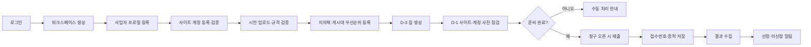

# 유니(youni) 플랫폼 기획서

> 문서 버전: v1.0 · 기준일: 2026-07-22 · 대상: 제품·개발·운영 의사결정을 맞추기 위한 기준안

## 1. 제품 한 줄 정의

유니는 광고대행사와 소상공인이 지자체·수탁기관별 현수막 게시대 신청을 놓치지 않도록,
사업자 정보와 시안을 미리 준비하고 접수·결과 확인을 자동화하는 멀티테넌트 업무 플랫폼이다.

핵심 가치는 **당첨 보장**이 아니라 다음 세 가지다.

1. 매월 짧게 열리는 신청 창구의 누락 방지
2. 반복 입력과 결과 확인에 드는 시간 절감
3. 규격 위반과 사이트 장애를 신청 전에 발견

## 2. 해결하려는 문제

현수막 게시대 접수는 지자체가 아닌 수탁기관이 운영하는 경우가 많고, 사이트·계정·일정·규격이
지역마다 다르다. 사용자는 매월 정해진 기간에 각 사이트에 로그인하고, 게시대를 고르고,
시안을 첨부한 뒤 결과까지 다시 확인해야 한다.

현재 문제를 사용자 관점에서 정리하면 다음과 같다.

| 문제 | 현재 방식 | 유니의 해결 방식 |
|---|---|---|
| 신청 기간 누락 | 달력·메신저·담당자 기억에 의존 | 창구 자동 생성, D-3/D-1 점검, 오픈 시 실행 |
| 반복 입력 | 사이트마다 사업자 정보를 재입력 | 프로필·계정·시안을 사전 등록해 재사용 |
| 규격 반려 | 공고문을 사람이 매번 대조 | 결정적 규칙 + AI 보조 검증 |
| 사이트 구조 차이 | 담당자가 사이트마다 절차를 학습 | 지자체 어댑터로 차이를 캡슐화 |
| 결과 확인 지연 | 마이페이지를 반복 방문 | 로그인 기반 결과 수집과 알림 |
| 장애 대응 불투명 | 실패 원인과 시점을 알기 어려움 | 단계별 감사 증적, 재시도, 수동 처리 폴백 |

## 3. 목표 고객과 우선순위

### 3.1 1차 고객: 지역 광고대행사

- 여러 광고주의 신청을 매월 반복한다.
- 신청 누락의 손실과 반복 업무 비용이 크다.
- 사이트 계정과 현수막 시안을 이미 보유하고 있다.
- 초기 제품이 완전한 셀프서비스가 아니어도 운영자 지원을 받아 사용할 수 있다.

주요 과업(JTBD):

> “다음 달 게시분을 준비할 때, 매번 접수 사이트를 확인하지 않고도 원하는 게시대 신청이
> 제때 제출되고 결과를 한곳에서 확인하고 싶다.”

### 3.2 2차 고객: 현수막 제작업체

- 시안 제작과 게시대 신청을 함께 대행하는 업체다.
- 규격 검증과 여러 광고주 프로필 관리의 가치가 크다.

### 3.3 3차 고객: 소상공인 직접 사용자

- 신청 빈도는 낮지만 절차 학습 비용이 높다.
- 모바일 온보딩과 건당 결제가 준비된 뒤 확장한다.

초기 3개월에는 1차 고객만을 기준으로 제품 결정을 내린다. 소상공인 셀프서비스 요구가
대행사용 핵심 흐름을 늦추지 않도록 분리한다.

## 4. 제품 원칙

1. **사용자 본인 계정으로 본인 신청을 돕는다.** 다계정 우회나 중복 신청 기능은 제공하지 않는다.
2. **확실하지 않으면 제출하지 않는다.** 계정·시안·게시대·창구 상태가 준비되지 않으면
   자동 제출 대신 `needs_manual`로 전환한다.
3. **자동화보다 증적이 먼저다.** 로그인, 게시대 선택, 시안 첨부, 최종 응답을 감사 기록으로 남긴다.
4. **AI는 보조 판정이다.** 파일 형식과 비율은 코드로 판정하고, AI 판정은 근거와 함께 노출한다.
5. **사이트별 금지 정책을 존중한다.** 자동화가 허용되지 않거나 검증되지 않은 사이트는
   `autoSubmit=false`로 유지한다.
6. **한 번의 창구 사이클을 완주한 기능만 출시로 본다.** 화면 존재나 단위 테스트 통과만으로
   운영 준비 완료라고 판단하지 않는다.

## 5. 제품 범위

### 5.1 MVP 필수 범위(P0)

- 이메일 매직링크 로그인
- 워크스페이스, 사업자 프로필, 수탁기관 사이트 계정 등록
- 계정 비밀번호 앱 레이어 암호화
- 시안 업로드 및 지자체 규격 검증
- 지자체·시안·게시대 우선순위로 상시 신청 등록
- 신청 창구 생성 및 D-3/D-1 준비 점검
- 화성시 로그인 → 게시대 선택 → 시안 첨부 → 제출
- dry-run과 실제 제출의 명확한 분리
- 제출 성공 응답/접수번호 검증
- 실제 이메일 알림
- 로그인 기반 선정 결과 수집
- 단계별 감사 스크린샷과 운영자 재처리
- 테넌트 데이터 격리와 교차 참조 방지

### 5.2 첫 유료 고객 범위(P1)

- 사용자가 이해할 수 있는 온보딩 체크리스트
- 신청별 준비 상태와 실패 복구 안내
- 운영자용 잡·어댑터·미매칭 결과 화면
- 오산시 또는 두 번째 실사용 지자체 어댑터
- 수동 청구/입금 관리
- 장애 알림, 백업·복구 절차, 창구 운영 런북

### 5.3 상품화 이후(P2)

- 정기결제와 요금제 제한
- 카카오 알림톡
- 셀프서비스 가입·해지
- 지자체별 공개 안내/SEO 페이지
- 경쟁률·선정 이력 분석
- 게시대 지도와 추천

### 5.4 현재 제외 범위

- 캡차 자동 해제
- 사용자를 대신한 사이트 회원가입
- 당첨 보장 또는 확률 조작
- 수탁기관 정책을 우회하는 대량·다계정 신청
- AI만으로 규격 적합성을 확정하는 기능
- 검증되지 않은 사이트의 자동 결제

## 6. 핵심 사용자 흐름

사용자가 자동 신청을 등록하기 전에 보여줘야 하는 준비 상태는 다음 다섯 항목이다.

- 지자체가 `active`이고 자동 제출이 허용됨
- 해당 지자체 계정이 등록되고 최근 로그인 점검을 통과함
- 사업자 프로필의 필수 필드가 채워짐
- 시안 검증 결과가 `pass` 또는 사용자가 확인한 `warn`
- 하나 이상의 활성 게시대가 우선순위에 포함됨

하나라도 충족하지 않으면 “자동 신청 등록” 대신 해결 방법과 수동 신청 경로를 보여준다.

## 7. 정보 구조

### 사용자 영역

| 메뉴 | 목적 | 핵심 정보/행동 |
|---|---|---|
| 홈/신청 현황 | 오늘 해야 할 일을 한눈에 확인 | 창구, 준비 실패, 제출 상태, 결과 |
| 자동 신청 | 상시 신청 생성·일시정지 | 지자체, 프로필, 시안, 계정, 게시대 우선순위 |
| 시안 | 파일과 규격 판정 관리 | 업로드, 버전, 지자체별 검증, 수정 사유 |
| 사업자/계정 | 재사용 데이터 관리 | 프로필, 사이트 계정, 마지막 로그인 성공 시각 |
| 캡차 | 사용자 응답이 필요한 예외 처리 | 이미지, 남은 시간, 답 제출 |
| 알림 | 사건 이력 확인 | 발송 채널, 발송 상태, 관련 신청 링크 |

### 운영자 영역

| 메뉴 | 목적 | 핵심 정보/행동 |
|---|---|---|
| 운영 대시보드 | 창구 전체 상태 확인 | 오늘 창구, 성공률, 지연·실패 잡 |
| 잡 상세 | 실패 진단과 안전한 재처리 | 시도 이력, 마지막 단계, 증적, 재시도 |
| 어댑터 상태 | 사이트 구조 변경 감지 | healthCheck, 최근 성공, broken 전환 |
| 결과 검수 | 미매칭/애매한 결과 확인 | 원문, 후보 잡, 수동 매칭 |
| 지자체 설정 | 규격·일정·기능 플래그 관리 | 버전, 출처, 활성화 게이트 |

## 8. 기능 요구사항과 완료 기준

### 8.1 신청 준비

- 다른 테넌트의 프로필·시안·계정을 참조할 수 없어야 한다.
- 계정의 지자체와 신청 지자체가 일치해야 한다.
- 선택한 게시대가 신청 지자체에 속해야 한다.
- `broken`, `disabled`, 검증 전 `beta` 지자체는 자동 제출 예약을 만들 수 없어야 한다.
- `once` 신청은 한 창구 잡 생성 후 자동으로 `expired`가 되어야 한다.

### 8.2 제출

- 동일 신청·동일 창구는 잡이 하나만 생성되어야 한다.
- 최종 제출 전 dry-run에서는 절대 제출 요청이 발생하지 않아야 한다.
- 실제 제출은 성공 문구, 접수번호, 신청내역 중 하나 이상의 확정 신호를 확인해야 한다.
- 확정 신호가 없으면 `submitted`로 기록하지 않고 `needs_manual`로 전환해야 한다.
- 모든 시도는 시작·종료·결과·마지막 단계·스크린샷을 남겨야 한다.

### 8.3 알림

- `window_upcoming`, `precheck_failed`, `submit_ok`, `submit_fail`, `captcha_needed`,
  `needs_manual`, `result_selected`, `result_rejected`를 실제 이메일로 발송해야 한다.
- 공급자 응답 ID와 실패 사유를 저장해야 한다.
- 발송 실패를 `sent`로 처리하면 안 되며 재시도할 수 있어야 한다.
- 동일 사건의 중복 알림은 멱등키로 차단해야 한다.

### 8.4 결과

- uriad 계열은 각 제출 잡의 계정으로 로그인한 뒤 마이페이지를 조회해야 한다.
- 접수번호 정확 일치는 자동 확정하고, 이름/게시대 유사 매칭은 운영자 검수 후 확정한다.
- 빈 결과는 “발표 전”과 “파싱 실패”를 구분해야 한다.
- 결과가 확정된 뒤에만 창구를 `results_out`으로 전환해야 한다.

## 9. 도메인과 시스템 구성

현재 저장소 구조는 제품 경계와 대체로 일치한다.

| 영역 | 현재 모듈 | 책임 |
|---|---|---|
| 사용자 경험 | `apps/web` | 인증, 온보딩, 신청, 시안, 캡차, 상태 조회 |
| 비동기 실행 | `apps/worker` | 창구 생성, 큐, 제출, 크롤, 결과, 알림 |
| 도메인 규칙 | `packages/core` | 타입, 페이로드, 암호화, 창구 계산, 상태 전이 |
| 외부 사이트 차이 | `packages/adapters` | 지자체별 로그인·조회·제출 구현 |
| AI 보조 | `packages/ai` | 시안 검증, 규격/결과 구조화 |
| 데이터 | `packages/db`, `supabase` | DB 클라이언트, 테이블, RLS, Storage |

아키텍처상 반드시 지켜야 하는 경계는 다음과 같다.

- 웹은 사용자 세션과 RLS를 통해서만 테넌트 데이터를 변경한다.
- 워커는 `service_role`을 사용하므로, 잡 컨텍스트를 읽을 때 테넌트·지자체 일치 여부를
  애플리케이션과 DB 제약 양쪽에서 검증한다.
- 어댑터는 브라우저 조작과 외부 사이트 파싱만 담당하고, DB 상태 전이는 워커가 담당한다.
- 상태 변경은 `packages/core`의 상태 머신을 실제 저장 경로에서 강제한다.

## 10. 신뢰·보안·정책

### 보안 기준

- 사이트 비밀번호는 AES-256-GCM으로 저장하고 로그·감사 화면에 노출하지 않는다.
- 암호화 키와 worker 공유 비밀은 환경별로 분리하고 주기적 교체 절차를 둔다.
- Storage 경로는 항상 `{tenant_id}/...` 규약을 사용한다.
- 계정·시안·사업자·신청의 테넌트 일치성을 복합 외래키 또는 보안 RPC로 강제한다.
- 운영자 재처리와 규격 변경은 감사 로그를 남긴다.

### 정책 기준

- 서비스 설명과 약관에 “당첨 보장 아님”, “사용자 본인 계정으로 입력 자동화”를 명시한다.
- 사이트별 이용약관·로봇 정책·운영기관 협의 상태를 지자체 설정에 기록한다.
- `autoSubmit` 활성화는 문서 확인, 실계정 dry-run, 실제 1건 제출의 순서로 승인한다.
- 개인정보 보유기간, 계정 삭제, 백업에서의 삭제 처리 절차를 유료 베타 전에 확정한다.

## 11. 운영 모델

월초 창구 기간과 평시의 업무를 분리한다.

| 시기 | 운영 초점 |
|---|---|
| D-7~D-4 | 규격·일정 변경 확인, 어댑터 healthCheck |
| D-3 | 신청 잡 생성, 사용자 준비 상태 알림 |
| D-1 | 사이트 구조·모든 대상 계정 로그인 점검, 실패 건 수동 전환 |
| D-day | 신규 개발 중지, 큐·worker·제출 성공률 모니터링 |
| D+1~결과일 | 누락·실패 복구, 결과 수집 점검 |
| 평시 | 어댑터 개발, 제품 개선, 회고와 런북 갱신 |

장애 시 우선순위는 `실제 신청 보호 → 사용자 알림 → 원인 진단 → 자동화 복구` 순서다.

## 12. 성공 지표

### 북극성 지표

**운영자 개입 없이 완료된 유효 신청 사이클 수**

유효 사이클은 준비 점검, 제출 성공 확인, 결과 알림까지 모두 완료된 신청이다.

### 단계별 지표

| 단계 | 핵심 지표 | 통과 기준 |
|---|---|---|
| 화성 검증 | dry-run 완주율 | 실창구 100%, 증적 누락 0 |
| 본인 실사용 | 제출 성공률 | 2개 연속 창구에서 100% |
| 베타 | 무개입 완료율 | 90% 이상 |
| 상품화 | 제출 성공률 | 최근 90일 95% 이상 |
| 상품화 | 사전 점검 탐지율 | 제출 전 장애의 90% 이상 탐지 |
| 사업 | 첫 가치 도달 시간 | 가입 후 15분 이내 신청 준비 완료 |
| 사업 | 유료 전환 | 베타 3~5곳 중 1곳 이상 |

보조 지표로 알림 도달률, 결과 매칭률, 어댑터별 broken 시간, 건당 운영 개입 시간,
AI 검증 후 실제 반려율을 수집한다.

## 13. 가격·시장 진입 가설

초기에는 결제 모듈보다 가격 검증이 우선이다.

- 광고대행사 베타: 1~2개월 무료, 신청 사이클을 함께 운영
- 첫 유료안 A: 워크스페이스당 월 3~5만원
- 첫 유료안 B: 기본료 + 신청 성공 건당 과금
- 소상공인 건당 요금은 셀프서비스와 온라인 결제 이후 검증

가격 인터뷰에서는 “자동화 기능”보다 월 반복 업무 시간, 누락 비용, 복구 지원의 가치를 묻는다.

## 14. 출시 판정

### 내부 실사용 출시

- 화성 실계정 dry-run 성공
- 테넌트 참조 무결성 검증 완료
- 실제 이메일 알림 동작
- 제출 성공 확정 신호와 감사 증적 존재

### 제한 베타 출시

- 본인 계정으로 실제 제출 → 결과 알림 1사이클 완주
- 실패 잡의 수동 복구 런북 검증
- 개인정보처리방침·이용약관·계정 위임 동의 마련
- 타 테넌트 데이터 격리 자동 테스트 통과

### 유료 출시

- 베타 고객이 운영자 개입 없이 1사이클 완주
- 2개 이상 지자체 중 적어도 1개가 `active`
- 백업 복구 연습, 장애 알림, 월초 운영 당번 체계 준비
- 청구·환불·해지 절차 마련

세부 구현 순서와 슬라이스별 완료 조건은 [세부 개발 계획서](./development-plan.md),
사업 단계와 일정 게이트는 [상용화 로드맵](./roadmap.md)을 따른다.
